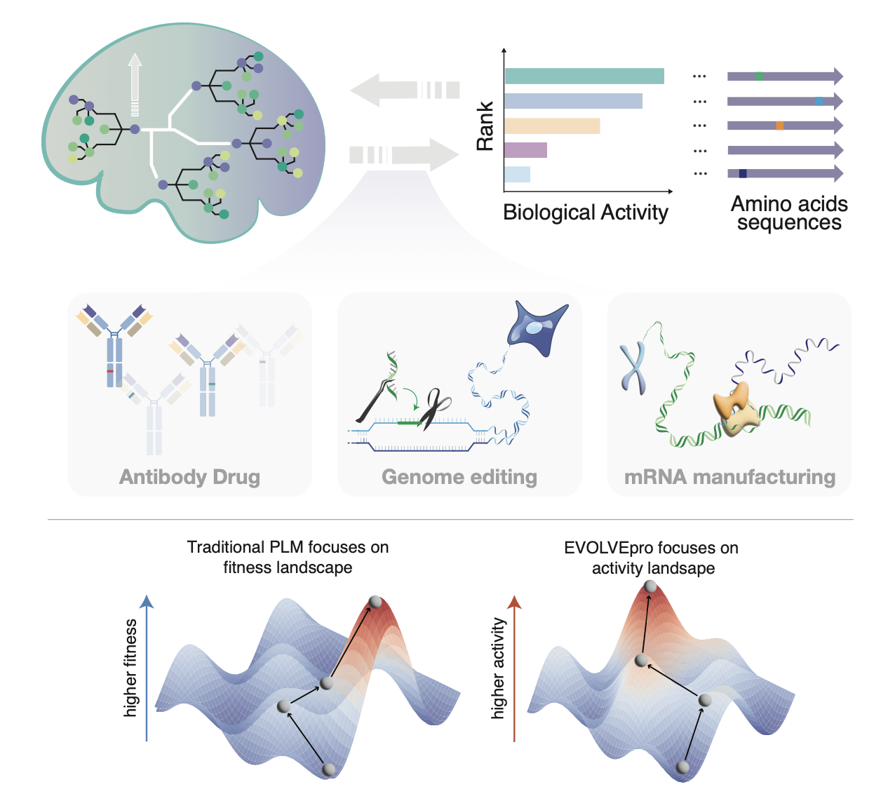
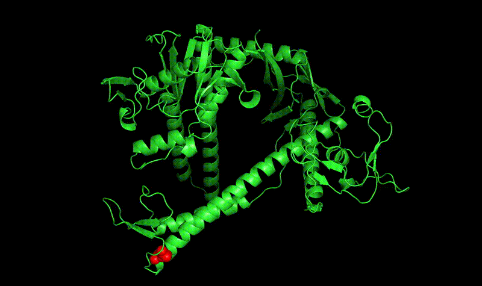
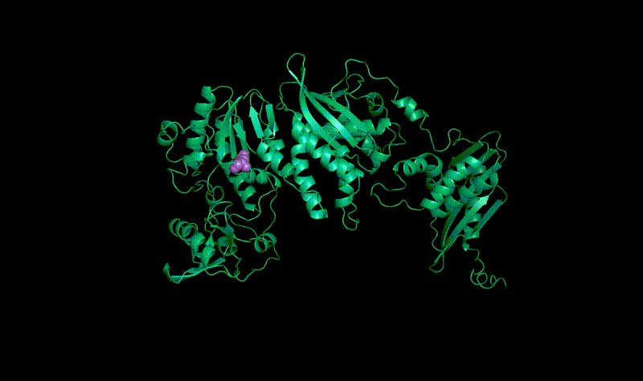

# EVOLVEpro



EVOLVEpro interprets PLMs embeddings through a top-layer regression model, learning the relationship between sequence and experimentally determined activities through an iterative active learning process. The lightweight random forest regression model can optimize multiple protein properties simultaneously during iterative rounds of testing with as few as 10 experimental data points per round, enabling complex multi-objective evolution campaigns and minimal experimental setup.

We employed an optimized version of EVOLVEpro to evolve a number of proteins:


*EVOLVEpro optimized PsaCas12f*


*EVOLVEpro optimized C143 Antibody*


*EVOLVEpro optimized T7 RNAP*

## Overview

The EVOLVEpro workflow consists of four main steps:

1. **Process**: Generate and clean FASTA and CSV files
2. **PLM**: Extract protein language model (PLM) embeddings for all variants
3. **Run EVOLVEpro**: Apply the model to either DMS or experimental data
4. **Visualize**: Prepare outputs and visualizations

## Step-by-Step Description

### 1. Process

Generate and clean FASTA and CSV files containing protein variant sequences and their corresponding activity data.

For detailed instructions, see the [Process README](scripts/process/README.md).

### 2. PLM

Extract protein language model embeddings for all variants using various PLM models.

For detailed instructions, see the [PLM README](scripts/plm/README.md).

### 3. Run EVOLVEpro

Apply the EVOLVEpro model to optimize protein activity. There are two main workflows:

#### DMS Workflow
Use this workflow to optimize a few-shot model on a deep mutational scanning (DMS) dataset, where activity values are known for a large number of variants.

For detailed instructions, see the [DMS README](scripts/dms/README.md).

#### Experimental Workflow
Use this workflow for iterative experimental optimization of protein activity.

For detailed instructions, see the [Experimental README](scripts/exp/README.md).

### 4. Plot

Prepare outputs and create visualizations to interpret the results of the EVOLVEpro process.

For detailed instructions, see the [Plot README](scripts/plot/README.md).

## Getting Started

### Install

```bash
git clone https://github.com/mat10d/EvolvePro.git
cd EvolvePro
```

### EVOLVEpro Environment

First, create and activate a conda environment with all necessary dependencies for EVOLVEpro:

```bash
conda env create -f environment.yml
conda activate evolvepro
```

### Protein Language Models Environment

For installing all underlying protein language models, we use a different environment:

```bash
sh setup_plm.sh
conda activate plm
```

This environment includes:

- Deep learning frameworks (PyTorch)
- Protein language models that are installable via pip (ESM, ProtT5, UniRep, ankh, unirep)
- Protein language models that are only installable from github environments (proteinbert, efficient-evolution)

These environments are kept separate to maintain clean dependencies and avoid conflicts between the core EVOLVEpro functionality and the various protein language models.

## Colab Tutorial

For a step-by-step guide on using EVOLVEpro to improve a protein's activity, simulated on a small dataset that we used as part of the DMS work, see our Google Colab tutorial [here](https://colab.research.google.com/drive/1YCWvR73ItSsJn3P89yk_GY1g5GEJUlgy?usp=sharing).

## Issues

If you encounter any bugs, have feature requests, or need assistance, please open an issue on our [GitHub Issues page](https://github.com/mat10d/EvolvePro/issues). When opening an issue, please:

1. Check if a similar issue already exists
2. Include a clear description of the problem
3. Add steps to reproduce the issue if applicable
4. Specify your environment details (OS, Python version, etc.)
5. Include any relevant error messages or screenshots

We welcome contributions and feedback from the community.

## Citation

If you use this code in your research, please cite our paper:

```
@ARTICLE
author={Jiang, Kaiyi and Yan, Zhaoqing and Di Bernardo, Matteo and Sgrizzi, Samantha R. and Villiger, Lukas and Kayabölen, Alişan and Kim, Byungji and Carscadden, Josephine K. and Hiraizumi, Masahiro and Nishimasu, Hiroshi and Gootenberg, Jonathan S. and Abudayyeh, Omar O.}
title={Rapid protein evolution by few-shot learning with a protein language model}, 
year={2024},
DOI={10.1101/2024.07.17.604015}
```